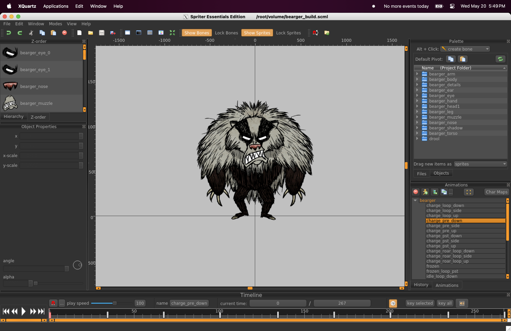

# Spriter

Docker instructions for using [Spriter] on an ARM Mac. 


Spriter is an animation tool with a unique file format used extensively in the mod tooling for [Don't Starve] and [Don't Starve Together]. The tools *rely* on this software, which is only officially compatible with Windows Vista and Ubuntu 14 ([downloads page]). To make it work on M1+ Macs, this repository contains docker configurations and scripts that will emulate the x86-64 Ubuntu environment and configure the display forwarding needed to get the program to run.



[Spriter]: https://brashmonkey.com/spriter-pro/
[downloads page]: https://brashmonkey.com/download-spriter-pro/
[Don't Starve]: https://store.steampowered.com/app/219740/Dont_Starve/
[Don't Starve Together]: https://store.steampowered.com/app/322330/Dont_Starve_Together/


## Setup 

1. Make sure you have [docker] installed. [Docker Desktop] might also be useful for a GUI.
2. Download this repository, open a terminal at the project root, and run 
    ```bash
    docker build -t spriter --platform linux/x86_64 .
    ```
    This creates the `spriter` Docker image with all of the necessary files.

[docker]: https://formulae.brew.sh/formula/docker
[Docker Desktop]: https://www.docker.com/

## Usage

Run `./open.sh path/to/directory/with/files`, where the second argument is the path to a directory containing files you would like accessible inside the container. That directory will be mounted to `/root/volume` in the container, and defaults to this project's root directory.
